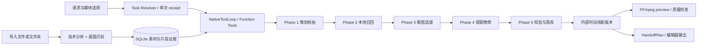

# 架构

本文描述当前 checkout 的实现，历史见 [changes/](changes/README.md)，契约见 [api.md](api.md)，决策见 [decisions.md](decisions.md)。本次为源码静态核实；真实媒体质量、桌面交互、远端服务和编辑器导入效果均**未核实**，待确认项见 [release-checklist.md](release-checklist.md)。

## 产品链路与分层

任务 7 增加了本轮体裁请求入口与完成回执边界：媒体快照携带 `genre`，用户手选由 Rust 守住，自动选择留给生成链；无新链元数据不填写故事版已判定体裁。每轮先额外一次只读模型请求，以当前会话快照与最近文本识别完成条件；问答禁写，生成/局部改镜无对应回执时续步，最终产物说明从持久化事实生成。普通问答再用只携带问题/公开事实、无工具的文案请求整理用户回复，内部信息过滤后标失败。`agentloop/facts.rs` 拥有完成条件、安全回复及持久化回执核对；不接管素材策划或选镜。转写占位工具已移出 Agent 目录。详情见 [任务 7 变更](changes/2026-10-05-genre-entry-agent-facts.md)。

Voycut 是 Windows 本地优先的策划与选镜 Agent 原型。当前仍按用户 brief 拆拍再召回/选镜；「先挑可用镜头再策划」和叙事/宣传/花絮体裁分流的产品方向不能当作已完成实现。



React 19 / TypeScript / Vite 运行于 Tauri 2 WebView。`App.tsx` 组合工作区，controllers 管状态与动作，components 展示，`src/lib/local-store.ts` 集中 invoke。Rust 校验作用域、访问 SQLite/媒体/凭据、请求模型、创建产物和审计。模型输出是提案；产物事实由数据库、文件与工具收据决定。代码地图见 [codebase/STRUCTURE.md](codebase/STRUCTURE.md)。

## 导入、共享范围与分析

### 媒体引用与素材库

导入保存本地源引用，不修改原始媒体。文件夹递归登记支持的媒体并保留安全目录投影；列表返回根名、相对路径、目录键和持久化状态，不逐条扫描源文件，不暴露绝对源引用。显式详情入口可授权选中源媒体的受限 asset URL，播放能力仍取决于 WebView 解码支持。

素材按导入根目录关联全局子库。`shared_libraries`、`project_libraries`、`shared_library_assets` 和 `project_asset_access` 统一访问范围，`assets.project_id` 是导入来源。新项目省略库列表时关联当时全部库，空列表不关联；后来出现的新库不自动加入，主动导入关联当前项目。复用素材 ID/分析结果，不复制媒体，重链路不改变库成员。

重命名只改显示名；移除写 `metadata.libraryRemoved`、取消首次分析，不删资产行/原媒体/既有时间线引用，共享素材编辑影响引用它的项目。健康扫描是显式可取消的后台元数据检查。重链路先预览唯一匹配，再确认更新，可保留或重做分析。收集媒体创建新包，不覆盖、不改原引用。

证据：`shared_library.rs`、`assets.rs`、`assets/{library,controls,health}.rs`。

### 技术分析与画面识别

FFprobe 读取时长/尺寸/帧率/音轨；FFmpeg 生成缩略图、样本帧与硬切候选，CLIP 核验切点。无已验证硬切、CLIP 不可用或两侧仍相似时整条一段，不按秒均分。段内帧差运动曲线只收缩可用窗，当前 `analysisVersion=4`。技术 worker 为逻辑核数 1/4、夹到 2–8，FFmpeg 解码线程按核数分配；运动与段内样本尽量同次顺序解码，补抽有独立预算。OCR 只调用 Tesseract `eng`，不能宣称中文招牌识别可用。音频导入本地计算节拍、小节、乐句和能量，不为节拍分析上传音频。

首次画面识别按硬切段整段送审：约每 15 秒一张图、每张 5 帧，最多 4 张/20 帧，超过 60 秒均匀铺开。样本宽 960，每张为一张大图加四张小图，编号与源时间来自本地。每段全部图同一请求；模型返回可见主体/动作/场景、文案/叙事功能及变化、主体位置、焦点、文字/品牌、人群/展会、最佳区间等 `VisualEvidence.detail`。Rust 夹回真实段内，不用文件名替代媒体语义。

视觉任务最多含 6 段，最多 16 个任务并行、同一素材互斥；Provider 单请求最多 4 图。瞬时视觉失败最多补跑 3 次，技术超时最多 2 次；用户取消/跳过、不适用与永久错误不自动补跑，不自动换 Provider。

`assets/progress.rs` 统一 ready/analyzing/queued/failed：视频/图片需技术与首次画面识别完成，音频等只需技术完成；readyVideo 另排除禁止使用和已知不可用源。取消持久化，启动不自动继续。发送前有可取消分析门：未完成时选择只用已分析素材，完成后可继续冻结请求；切换项目/会话取消待发送。素材页只在分析/扫描活动期间刷新，事件与动作唤醒查询。

片段证据契约 v1 由 `models.rs` 定形、`assets/evidence_contract.rs` 从冻结分析纯适配并生成内容寻址 ID。`get_asset_evidence.segmentEvidence` 完整暴露风险三态、分析/模型/方法来源、源窗、置信度，以及主体边界/方向/切点/高光等原始关系证据。旧正向风险按整段保留，旧否定/缺失无置信度时为未知；帧差运动能量不证明抖动，方向不证明轴线。

`assets/evidence_verification.rs` 只接收本次候选与缺项，验证项目范围后每段用至多四张时间网格并发请求统一 Provider，失败如实返回，仅 429 由传输层退避。补核验追加到 `asset_evidence_verifications`，按基础快照绑定并在回写事务重查，既不改旧分析，也不重跑全库。新旧事实冲突时保留全部，未知不变安全。本任务未把该能力接入现行导入/生成/Agent 默认行为，也未实现体裁底线和评分。

证据：`assets/{analysis,segments,motion,beats,visual,segment_visual,retry,progress,evidence_contract,evidence_verification}.rs`、`models.rs`、`useAnalysisGateController.ts`、`useAssetWorkspaceController.ts`。

## Agent、策划与选镜

### 请求与工具循环

`taskrouter.rs` 先绑定项目、editing task 和 conversation，只向归属模型提供当前活动任务，无活动任务则创建 task/conversation。确定后签发绑定完整请求的单次 receipt，user 消息占用它，提交消费后才创建 queued Agent task。

普通聊天、澄清、状态问答与执行统一进入 NativeToolLoop。完整 **32** 个 strict 工具 Schema 直接随每次 Provider 请求发送；Rust 复核白名单、参数形状、作用域与领域校验。普通请求不由关键词裁剪目录，品牌卡/转场仍有本轮明确意图守卫。项目/任务/会话由 LoopState 注入，模型不能传任意路径、SQL 或 FFmpeg 参数。

每轮注入安全权威状态快照，写工具后刷新；高层事实可直接用快照，详情另调观察工具。最多 10 步，单步 180 秒、整轮 1800 秒；40K token 触发压缩到 30K，60K 硬上限保护快照、当前请求和最近调用/结果对。同步 HTTP/配音/媒体使用剩余截止时间，ONNX 仅在阶段边界检查，不能强制中断。

工具结果按 call_id 交回模型；完成状态由 RunReceipt/真实产物裁决。后端同事务保存 task 终态、完成消息与 conversation 后才发 `agent-edit-completed`，前端事件/轮询重新读库对账。失败保留真实中间版本，可为 partially_completed；启动中断标 needs_review，不重放未知副作用。

证据：`taskrouter.rs`、`agent.rs`、`agentloop/{native,schema,snapshot,context,tools,skills}.rs`、`useAgentRunReconciliation.ts`。

### 各 Phase 的当前行为

新生成在 Phase 2 入池前执行 `storyboard/eligibility.rs`：按明确默认宣传读取片段契约与项目品牌套件名称，先挡住主体失焦、不可接受抖动、未识别为本项目的标识、展会/展台/展厅、杂乱背景。无品牌身份时带标识均排除，旧无时段正向事实覆盖整段。只为本拍召回需要的待核验候选请求未知风险，多候选并发，每请求沿用四图上限和仅 429 退避；淘汰后向下补候选，不放回硬风险。无单一片段契约的旧跨硬切双段组合先排除，零合格镜头返回带原因统计的 `storyboard_no_eligible_footage`。

合格集合进入独立可用性排序，再保留各拍内容匹配/多样性召回。主体裁切分根据源宽高、所选画幅和已采样水平边界计算；涉及裁切却没有相应边界时保持未知，不沿用写死竖屏标签。目标画幅更宽、需要上下裁切时也保持未知。该分是代理，缺纵向边界与最终裁切跟踪验证。叙事关系证据接口预留于 eligibility 模块，花絮空镜比例属于组合；真实体裁与最终源窗/旧版局部重选重验仍由任务 5/6/7 接入，现有 P1 策划时序未在本任务重做。

| 阶段 | 行为与事实边界 | 源码 |
|---|---|---|
| Phase 1 策划 / 拆拍 | 注入视觉/OCR 库存摘要，模型按 brief 写 narrative/beats；系统锁 scriptMode。配音开且有确认稿时先合成，真实口播为时钟；与点名时长差约 30% 则暂停问用户。配音关锁 key_message，默认不写屏幕字。粗拍有限软反馈，最后仍粗可收下。 | `storyboard.rs`、`storyboard/phases.rs` |
| Phase 2 本地召回 | ready 视频展开真实段，每拍 9 条，同素材/相似各最多 2；BGE/词面、CLIP、质量/时长/新鲜度评分。前面池中未选段不预扣；综合分优先名额默认 5，余位混入分项高分。 | `storyboard/{phases,semantic,clip}.rs` |
| Phase 3 看图选镜 | 各拍并发，候选源窗现拼网格，最多 4 张拼图/请求，弱匹配可扩 12 条。主选/替补限前 5，Rust 从候选序号映射真实 ID。默认一拍一镜，匹配且不相似才增至 2–3；撞车按拍序只修后拍，限制复用/相似/交叠。文字冲突以图为准。 | `storyboard/{phases,multimodal}.rs` |
| Phase 4 锁窗精修 | 在选中片段精修入出点/cropFocus，不拼下一段硬切；整片锁在 P3 源窗。Pass B/C 多帧拼网格、最多 4 镜/批并发；session 保留成功镜头/批次/采样，只修失败集合，结构错误不反复重做。 | `storyboard/phase4.rs`、`storyboard.rs` |
| Phase 5 校验 / 落库 | normalize 后校验源窗、覆盖、模式、时长、重复与结构；精修类可回 P4，硬限制直接失败。通过后保存故事版与 Top-12 推荐池；缺口返回 qualityWarnings，不冒充已覆盖。 | `storyboard.rs`、`shot_replacement.rs` |

生成不等首次识别，只收 ready 段卡；段无卡但有旧整片卡时按整条进池，不把整片标签抄给未打卡段。库存提示仍不保证策划每段先绑定具体镜头，不能写成产品核心重做已完成。

配音关时 P4 内容窗决定偏好时长，按目标比例缩放，优先让源窗/槽位等长（1 倍速），锁窗不足才放慢并写原因。BGM 开时先选曲（库内音频优先，其次 Jamendo）；稳定节拍可选乐句窗并卡点、保存 musicPlan/musicTiming，失败写原因后走内容时钟。配音开仍以口播为时钟，音乐切点仅在 ±120ms 移动。

局部改镜用 `reselect_shots`（最多 5 拍，P2→P5）或 `refine_shot_ranges`（最多 10 镜，P4→P5）；不重跑 P1，不改已配音稿，冻结其他镜头与音文轨，派生故事版+时间线同事务保存。手动换镜先读/生成推荐、精修候选与静音预览，再经 `commit_studio_edits` 保存；试选不改时间线。

证据：`storyboard/local_edit.rs`、`shot_replacement.rs`、`studio.rs`、`music_plan.rs`、`storyboard/music_cuts.rs`。

## 时间线、预览与编辑器交付

### 内部时间线

内部 timeline 是事实源，保存视频主轨/叠加轨、真实源窗/槽位、cropFocus、文本/音乐/旁白、品牌图层与转场。改动写新版本和审计，不覆盖旧版本。Studio 命令仍注册，不能据此把主界面描述为完整精修编辑器。

Agent `generate_storyboard` 同一调用自动时间线、媒体应用、preview 与所选编辑器交付；后续失败保留已保存版本，实际结果用 appliedMedia/mediaNotApplied、musicTiming、qualityWarnings。公开同名 Tauri 命令负责生成故事版，不等同 Agent 编排。

文本时间/样式/布局/动态由后端校验，ASS preview 与编辑器原生文字分别判兼容。配音写独立旁白轨与 alignment 字幕，voiceoverApplied 才证明旁白落地，字幕失败不回滚旁白。`transcribe_asset` 没有真实 ASR，已移出 Agent 目录，兼容分派返回未实现；不向 Agent 返回占位字幕。

品牌套件为项目设置，logo/字体按内容哈希复制到 app_data/brand。模板编译期嵌入，独立线程隐藏 WebView2 本地渲染 PNG；模型给模板/短文案，Rust 算时间/样式。图片文字不可编辑。转场为默认+逐刀覆盖、切点居中、不改总时长；fit_graphics 随版本重新贴合。

证据：`timeline.rs`、`timeline_voice.rs`、`agentloop/{auto_music,auto_graphics}.rs`、`brand_kit.rs`、`cards/`、`timeline_graphics.rs`、`subtitle.rs`。

### 本地预览

画幅来自故事版 mediaOptions，默认 9:16；画布为 540×960 / 960×540 / 720×720。FFmpeg 按源窗变速/cropFocus 裁切，合成 ASS、品牌 PNG、xfade 转场，旁白/BGM 单独混音，禁止 `-shortest` 截断口播。QC 检查黑帧、重复/相似源范围、节奏和文本安全区等，不是完整语义重复检测或最终视频导出。

缓存按源大小/修改时间、源范围与画面参数哈希复用镜头/底片/文字叠加，成功结果才入缓存。项目中间缓存默认 2 GiB，成功渲染后淘汰旧文件；清缓存需 confirmed=true，不删最终 preview、库或素材。preview 没有统一用户取消入口。

证据：`media_options.rs`、`preview.rs`、`preview_audio.rs`、`preview_graphics.rs`、`preview_cache.rs`。

### 输出端口

timeline 先投影 HandoffPlan，项目 settings_json.outputEditor 记选择；未选时检测优先 CapCut，仅有剪映则剪映，都无仍默认 CapCut，默认不写回。只新建、不覆盖、不回读、不反向同步。

| 端口 | 代码能力与限制 |
|---|---|
| 剪映 / CapCut | 注册表识别草稿库，随包 Python/SDK 写新草稿；编辑器运行时可延迟首页注册。视频变速/裁剪、叠加、受限原生文字、音乐、旁白、品牌 PNG 有写入代码；普通静态图片主镜头在能力表仍 Unsupported，不能混同品牌图层。 |
| FCPXML | 写本机 editor-handoffs 新文件，带媒体引用/音乐/旁白/品牌图；文本是可编辑 Basic Title，样式动画不带，变速/裁切受限。 |
| OTIO | 写新文件，带时间线/媒体引用/音乐/旁白/品牌图；文本为 marker，不是可编辑文字轨。 |

剪映/CapCut 要求 cue 通过后端兼容判定，默认描边/阴影字幕目前判定不一致，未在本次桌面验证。FCPXML/OTIO 只带叠化，黑场过渡保留硬切并写 notes；品牌渲染失败、文字降级与未验证转场也返回说明。写文件成功不证明编辑器正确打开，变速取窗、音轨、文字/裁切/转场仍须实测。

证据：`handoff/{mod,deliver,fcpxml,otio}.rs`、`jianying.rs`、`capcut.rs`、`src-tauri/scripts/create_jianying_draft.py`。

## 数据与作用域

```text
Project
├── 共享素材库关联 / 项目原有素材
├── 项目设置（编辑器、品牌、候选名额）
└── Editing Task（UI 剪辑会话）
    ├── Conversation → Messages / AgentTask / 审计
    ├── Storyboard versions → 推荐池
    └── Timeline versions（经 storyboard 归任务）
        └── Preview / 编辑器交付
```

新建剪辑会话入口同事务创建 task/conversation；产物按 project/task 查询和新建，timeline 经 storyboard 归任务，不用 conversation 猜产物。状态快照/Agent 上下文只读当前任务，侧栏 summary 仅展示。

version_number 保留项目唯一序号，schema v20 追加 task_version_number，UI/Agent 展示任务内 v1 起的新编号，旧空值回退旧序号，不回填。项目级共享素材、哈希预览中间缓存和选镜新鲜度（同项目最新时间线素材使用次数），不把兄弟任务产物当本任务事实。

schema v21 仅追加证据核验表和新故事版附加事实表 `storyboard_evidence_metadata`。后者存 `pipelineVersion/genre/recipeVersion/evidenceSnapshot/evidenceReferences`，新创建事务写一次，旧记录无行读为 null/空数组，不回填、不重编号；现行生成尚不填这些字段，读取/派生集成归任务 6。

SQLite WAL/busy timeout 与只追加迁移；task 快照、pending 路由、单次 receipt、pending 澄清保存归属/恢复。审计保存步骤/计数/安全码，不存模型全文或凭据。Rust 删除项目/会话要求 confirmed=true；会话删除保留项目素材、原媒体与外部草稿。前端 window.confirm 已登记可靠性问题，不能仅凭 Rust 参数声称确认 UI 有效。

证据：`db.rs`、`projects.rs`、`taskrouter.rs`、`audit.rs`、`agentloop/snapshot.rs`。

## 系统边界

- 原始媒体/项目/产物默认本地，但画面识别与选镜图片、文本/配音请求会发当前 Provider 或网关；本地优先不等于全离线。向量/OCR/节拍与媒体处理在本机。
- 内置网关构建仅走 Voycut 登录与服务，失败不回退本机模型/配音 key。无网关开发构建用自定义兼容 API 或实验性 OAuth；无网关配音仍有受限 Fish→ElevenLabs 传输失败回退。凭据走 Windows Credential Manager，界面语言偏好等非秘密便利状态才进前端存储。
- Provider 单请求最多 4 图、429 有界退避；登录/资格/版本/请求体过大等错误真实返回。网关生产配置/账号资格及官方 OAuth 支持范围**未核实**。
- process.rs 集中无窗口媒体子进程/超时/进程树回收。构建脚本捆绑 FFmpeg/FFprobe、embeddable Python/草稿 SDK、Tesseract/eng、DirectML 和模型小配置；默认 ONNX 权重后台下载至 app_data/runtime-models 校验，完整包可带权重。BGE 缺失降级词面，CLIP 缺失加权 0，DirectML 建会话/试算失败回退 CPU。
- read_logs 固定有界读取并遮蔽路径/凭据；debug 完整 Provider 转储为显式开发诊断，release 关闭。模型文字不能自证产物存在或编辑器可用。
- 最终视频导出未实现；preview 与编辑器交付不是最终导出。确认 UI 与真实桌面效果按 release-checklist 验收，静态对照不替代它。

证据：`provider.rs`、`fellowcut_account.rs`、`music_provider.rs`、`voice_provider.rs`、`oauth.rs`、`custom_api.rs`、`process.rs`、`runtime_models.rs`、`onnx_device.rs`、`scripts/run-tauri.mjs`。协作/检查入口为 CONTRIBUTING.md 和 [harness.md](harness.md)。
