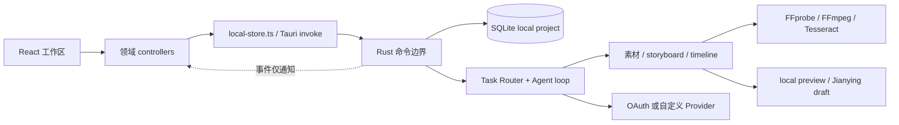
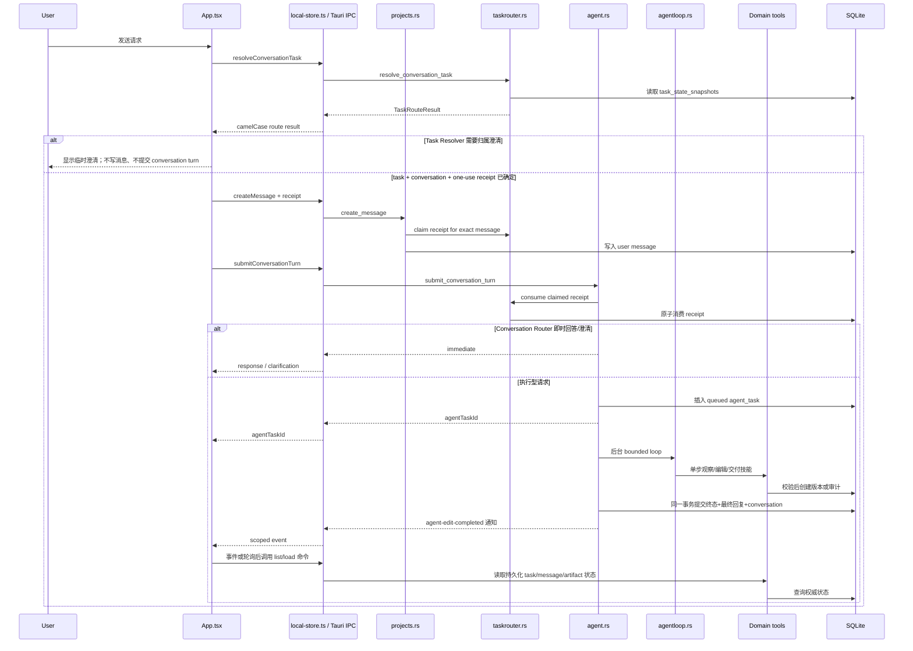
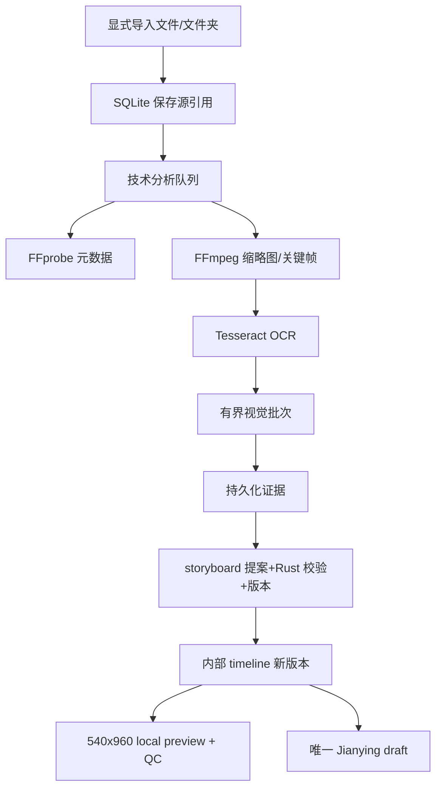

# 架构导览

## 1）架构风格

这是本地优先的分层桌面 Agent，不是浏览器直接调用云 API 的 Web 应用，也不是传统剪辑器。

- React/WebView 负责意图输入、状态投影与工作区展示。
- TypeScript bridge 把前端调用限制为命名 Tauri 命令。
- Rust 是可信执行边界：校验作用域、访问 SQLite/文件、运行媒体进程、调用 Provider、创建版本和审计。
- 模型只在封闭技能空间中选择动作；真实产物完成门由 Rust 判断。
- storyboard、timeline、preview、Jianying draft 是逐级派生关系；内部 timeline 是事实来源。
- 编码 Agent 的上下文按根/React/Rust 三层加载；机器 harness 只强制可确定的跨层所有权，不能替代领域测试。

## 2）总览



## 3）自然语言请求链路



关键不变量：任务归属确定前不写消息；receipt 只能消费一次；项目事实问答必须真实观察；明确负向要求缩小工具权限；事件丢失不能丢失最终回复。

## 4）媒体与产物链路



素材列表读取持久化投影，不逐条探测源路径。健康检查、重链路、分析、下载和交付都是独立具名副作用。

## 5）模块职责与依赖方向

| 模块 | 拥有 | 不应拥有 | 证据 |
| --- | --- | --- | --- |
| React components | 展示和局部开合状态 | Tauri 调用、任务路由 | `src/components/` |
| React controllers | 领域投影、轮询、用户动作编排 | SQL、模型 prompt | `src/hooks/` |
| `taskrouter` | task 归属和 receipt | 具体工具选择 | `src-tauri/src/taskrouter.rs` |
| `agent` | conversation 决策入口、run 生命周期、原子终态 | 媒体实现 | `src-tauri/src/agent.rs` |
| `agentloop/policy` | 工具授权、请求负向约束、目标与真实产物完成门 | 数据库、文件、Tauri、Provider、外部进程 | `src-tauri/src/agentloop/policy.rs` |
| `agentloop` 父模块 | Router、状态、prompt、技能选择和派发 | 绕过 policy 或任意 SQL 自由访问 | `src-tauri/src/agentloop.rs` |
| 领域模块 | 作用域校验后的领域读写 | 用户意图分类 | `assets.rs`、`timeline.rs` 等 |
| `provider` | 可替换模型传输和调度 | 产物完成事实 | `src-tauri/src/provider.rs` |
| `db` / `audit` | schema、连接策略、安全审计 | UI 文案与模型原文 | `db.rs`、`audit.rs` |

## 6）反复出现的模式

| 模式 | 位置 | 目的 |
| --- | --- | --- |
| Adapter | `local-store.ts`、`provider.rs`、`jianying.rs` | 隔离 IPC、模型协议和外部草稿格式 |
| Append-only version | storyboard/timeline 表与创建函数 | 不覆盖历史创作产物 |
| Transactional finalization | `agent::finalize_agent_task` | 任务、回复、conversation 和审计同一事务；提交后再通知 |
| Event + polling reconciliation | `useAgentRunReconciliation` | 事件提供低延迟，SQLite 提供恢复事实 |
| Bounded worker/loop | `assets.rs`、`agentloop.rs` | 防止媒体或模型无限占用资源 |
| Strategy enum | `provider::ModelAccess` | 自定义 API 优先，OAuth 后备且错误封闭 |
| Scope receipt | `taskrouter.rs` | 防止消息或副作用落入错误任务 |

## 7）巨型模块的安全拆分图

当前应处理，但按“搬迁职责、保持命令名”逐步拆，不重写行为。

```text
agentloop.rs
  -> agentloop/policy.rs       已完成：负向约束、工具集合、目标门
  -> agentloop/router.rs       Conversation Router schema/校验
  -> agentloop/state.rs        历史、快照、产物完成事实
  -> agentloop/prompt.rs       prompt 与安全失败上下文
  -> agentloop/executor.rs     run_step / apply_skill / terminal
  -> agentloop/mod.rs          10 步 orchestration 与公开 crate API

assets.rs
  -> assets/import.rs          导入、store、重链路、收集
  -> assets/technical.rs       FFprobe/FFmpeg/Tesseract 与 worker
  -> assets/visual.rs          批次、排序、Provider、熔断恢复
  -> assets/library.rs         page、目录投影、Agent 搜索/片段
  -> assets/health.rs          显式健康扫描与快照
  -> assets/metadata.rs        标签/集合/用户元数据
  -> assets/mod.rs             保持现有 Tauri 命令 re-export
```

`agentloop/policy.rs` 已完成纯迁移。下一步提取 `assets/library.rs` 的安全目录投影/只读查询，再处理 Agent router/state；然后搬 worker，最后才移动事务和命令入口。每一步保持 `lib.rs` 注册名、TypeScript wrapper、SQL schema 和 fixture 不变。

## 8）已知架构风险

- `agentloop.rs` 已从 4264 行降至 3599 行，但 Router、状态、prompt、循环、executor 和测试仍耦合；`assets.rs` 仍为 4114 行热点。
- `timeline.rs` 1848 行同时含镜头、文本、音乐和查询；应在前两个热点稳定后处理。
- SQL 分散在多个领域模块，跨表事务移动时容易破坏原子性。
- Agent fixture 目前验证白名单结构，但完整多轮 provider-script runner 尚未实现。
- 前端已分层，但 `App.tsx` 仍承担 task/conversation 编排并接近硬预算。
- Agent 交接仍依赖准确的 Git 状态、当前任务窗口和验收证据；机器检查不能证明模型理解了全部产品语义。

## 9）证据

- `src-tauri/src/lib.rs`
- `src-tauri/src/agent.rs`
- `src-tauri/src/agentloop.rs`
- `src-tauri/src/agentloop/policy.rs`
- `src-tauri/src/assets.rs`
- `src-tauri/src/taskrouter.rs`
- `src/App.tsx`
- `src/hooks/useAgentRunReconciliation.ts`
- `.harness/agent-context.json`
