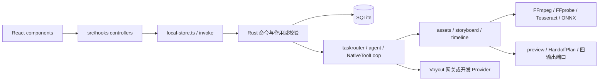

# 架构导览

本页沿当前源码定位职责和调用方向；产品链路见 [../architecture.md](../architecture.md)，注册契约见 [../api.md](../api.md)。本次只做静态核对，桌面/远端服务/编辑器效果未核实。

## 分层与所有权

```mermaid
flowchart LR
  UI[React components] --> Controllers[src/hooks controllers]
  Controllers --> Bridge[local-store.ts / invoke]
  Bridge --> Commands[Rust 命令与作用域校验]
  Commands --> DB[(SQLite)]
  Commands --> Agent[taskrouter / agent / NativeToolLoop]
  Agent --> Domain[assets / storyboard / timeline]
  Domain --> Media[FFmpeg / FFprobe / Tesseract / ONNX]
  Agent --> Provider[Voycut 网关或开发 Provider]
  Domain --> Artifacts[preview / HandoffPlan / 四输出端口]
```

| 所有者 | 当前职责 | 边界 |
|---|---|---|
| components / hooks | 展示、分析门、请求快照、查询和事件/轮询对账 | 不直接 SQL/Provider；invoke 集中 bridge |
| taskrouter.rs | 活动 task 归属、pending route、单次 receipt | 不选择工具，不向路由模型注入兄弟任务 |
| agent.rs | queued run、后台调用、终态/回复原子提交、取消 | 模型文本不裁决产物事实 |
| agentloop/native.rs | 完整工具 Schema、call_id、RunReceipt、有界循环 | policy/native 白名单、LoopState 作用域与领域校验 |
| agentloop/tools.rs / policy.rs | 33 个 strict Schema / 观察与编辑工具名 | TS 名称镜像不参与授权；没有动态加载工具协议 |
| assets/ | analysis、segments/motion、visual/segment_visual、progress/controls、library/health、retry/beats | 原媒体只读；共享范围通过 project_asset_access |
| storyboard/ | P1–P5、BGE/CLIP 召回、网格、局部精修 session、local_edit/recommendations/music_cuts | 检查真实 ID/源窗后落库；局部编辑冻结其他镜头 |
| timeline / studio / timeline_voice / timeline_graphics | 新版本、轨道、换镜、音文轨、图层与转场 | 不覆盖旧版本；Studio 试选不等于已提交 |
| preview / preview_audio / preview_graphics / preview_cache | 画幅、ASS/图片/转场、混音、缓存与 QC | preview 不是最终导出 |
| handoff/ / jianying / capcut | timeline→HandoffPlan→新草稿或 FCPXML/OTIO | 单向、不覆盖；交付限制写 notes |
| provider / music_provider / voice_provider / fellowcut_account | 网关/开发 Provider、配音、Jamendo、凭据投影 | 内置网关失败不回退本机 key |
| db / audit / process / runtime_models / onnx_device | 只追加迁移、审计、无窗口进程、权重下载、DirectML/CPU | 不能由模型任意操作底层能力 |

## 请求到终态

1. 前端冻结本轮文案、媒体选项和 uiLocale，分析未完成时由分析门确认只用 ready 素材。
2. resolve_conversation_task 选当前任务或创建 task/conversation，返回绑定完整请求的 receipt。
3. create_message 占用 receipt；submit_conversation_turn 消费一次、插入 queued task、返回 agentTaskId。
4. NativeLoop 加载本会话消息、权威快照和完整 33 项 Schema；模型选工具，Rust 参数/作用域/领域校验后执行，结果按 call_id 返回。
5. 有界循环最多 10 步、单步 180 秒、整轮 1800 秒；上下文 40K→30K、硬上限 60K。失败保留真实中间产物，终态由收据判定。
6. task 终态、完成消息和 conversation 同事务保存后通知；前端重新读持久化消息/产物，事件丢失可由轮询恢复。

高层状态快照本身构成观察；没有「事实问答每次必调观察工具」或「关键词缩小全部工具权限」规则。卡片、转场等能力在领域执行处保留明确意图要求。

## 媒体到交付

导入保存源引用和共享库成员 → 技术队列（核数 1/4，2–8 worker）→ FFmpeg 硬切/CLIP 验真、运动可用窗与样本帧 → 每段多图视觉证据（最多 4 图/请求，16 个任务并发）→ P1 按 brief 拆拍 → P2 每拍 9 段召回 → P3 各拍看图并发选片 → P4 锁段入出点/cropFocus → P5 本地校验/版本/推荐池。

Agent 生成随后自动时间线、配音/BGM/品牌应用、preview 和所选编辑器交付，子产物失败不回滚已存版本。公开 Tauri 同名 generate_storyboard 不包含完整 Agent 后续编排。画布为 540×960 / 960×540 / 720×720，preview 混入旁白与音乐。四端口有旁白写入代码，剪映/CapCut 普通图片主镜头仍不支持，品牌 PNG 为独立图层。FCPXML 文本为基础 Title，OTIO 为 marker。

## 数据与恢复

- UI 剪辑会话以 editing task 为单位；timeline 通过 storyboard 归任务，查询按 project/task 校验。
- 素材共享访问、预览中间缓存和素材新鲜度是项目级；不会把其他任务的产物作为当前事实。
- task_version_number 供 UI/Agent 展示任务内版本，旧空值回退历史项目编号，不回填。
- receipt、pending 路由/澄清、快照持久化；中断 Agent 标 needs_review，不重放未知副作用。分析任务另有队列恢复和取消/隐藏写回守卫。
- 删除要求后端 confirmed=true；当前前端 window.confirm 可靠性问题尚待修，不可把参数门等同桌面确认有效。

## 当前关注边界

模块已拆出 assets/library、analysis、health、visual、controls、progress、segments/motion，以及 agentloop/native、tools、skills、snapshot、context 等；这些不能继续写成待拆模块。SQL 仍分散在领域文件，搬迁需保留跨表事务。工具目录/白名单/TS 镜像仍要同步；fixture_only 场景不等于完整多轮 Agent E2E。transcribe_asset 为占位，不是真实 ASR。风险见 [CONCERNS.md](CONCERNS.md)，流程按 CONTRIBUTING.md，不能由代码地图另派重构路线。

## 证据

- src-tauri/src/lib.rs、src/lib/local-store.ts、src/lib/agent-tools.ts
- src-tauri/src/taskrouter.rs、agent.rs、agentloop/{native,tools,policy,schema,skills,snapshot,context}.rs
- src-tauri/src/assets/、storyboard.rs、storyboard/、studio.rs、timeline.rs
- src-tauri/src/handoff/、jianying.rs、capcut.rs、src-tauri/scripts/create_jianying_draft.py
- src-tauri/src/media_options.rs、preview.rs、preview_audio.rs、preview_cache.rs
- src/hooks/useAgentRunReconciliation.ts、useAnalysisGateController.ts
- .harness/agent-context.json、src-tauri/tests/fixtures/README.md
